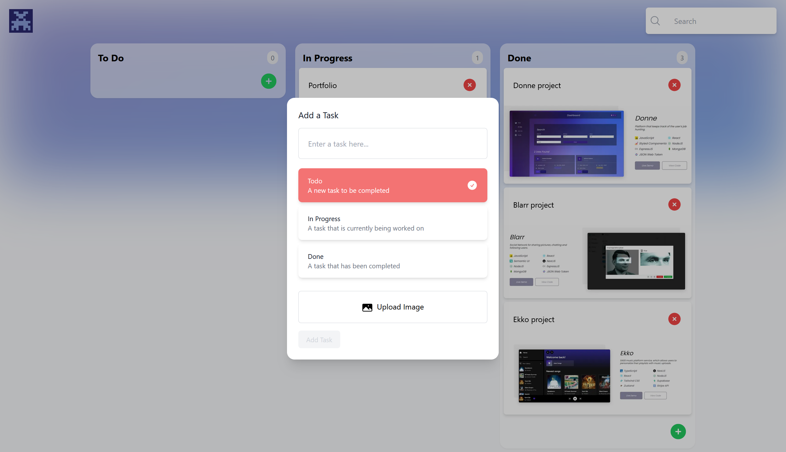

# Tasker

<h4>Platform for organizing personal projects by status with the following features:
 
  Includes search feature and image uploads</h4>

- [x] Create and delete projects for different status categories
- [x] Image uploads
- [x] Search projects
- [x] Managing projects on Appwrite's database

<h3>Main technologies applied:</h3>

